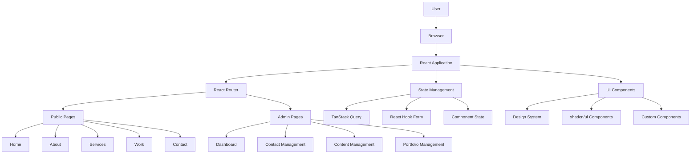
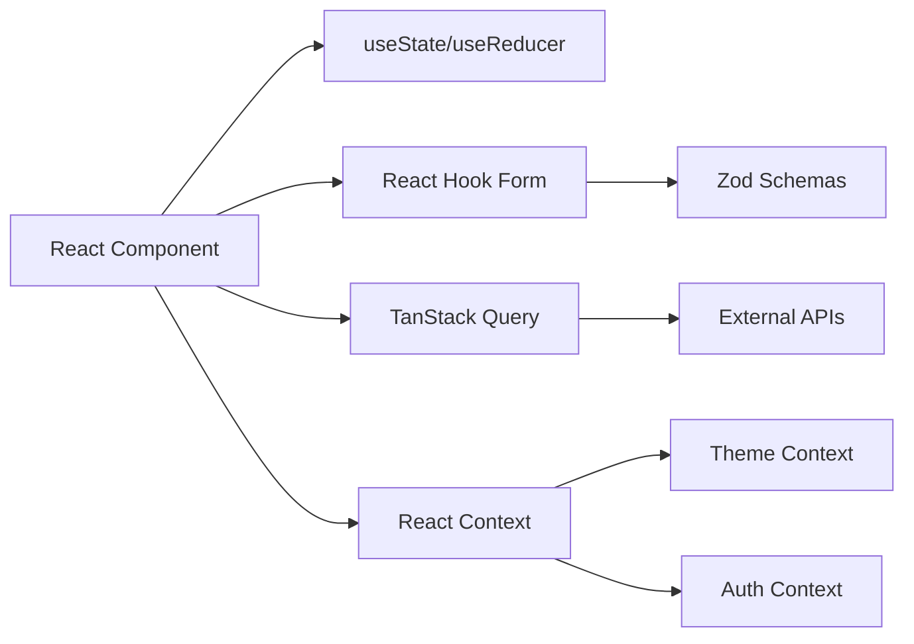
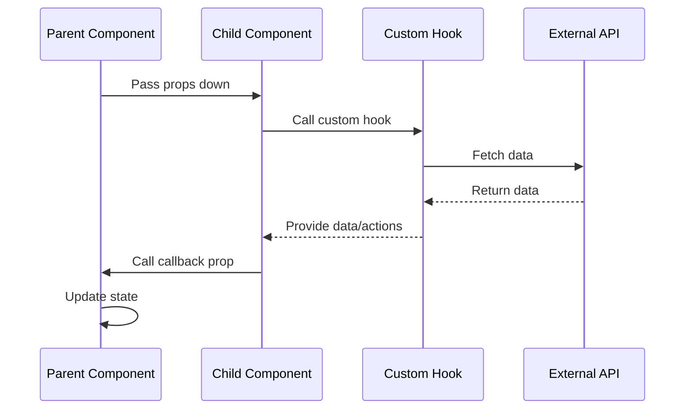
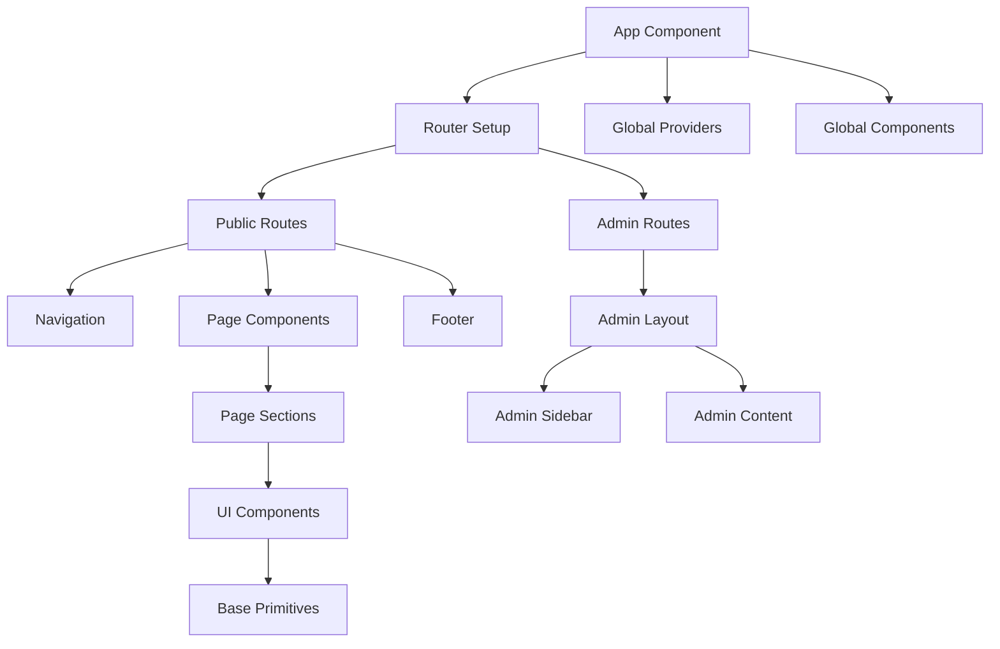
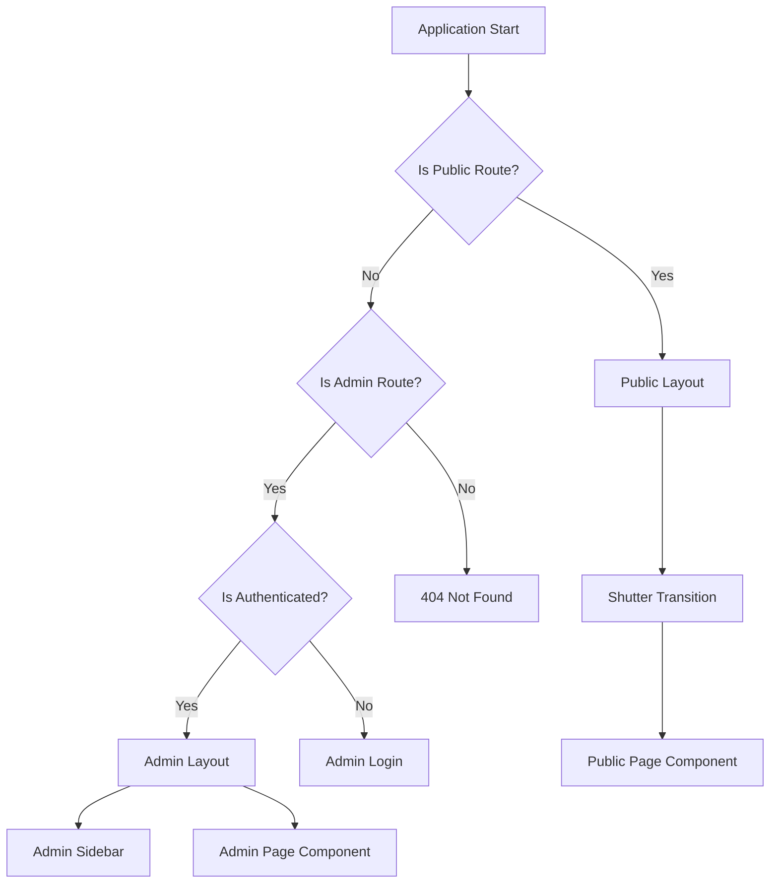
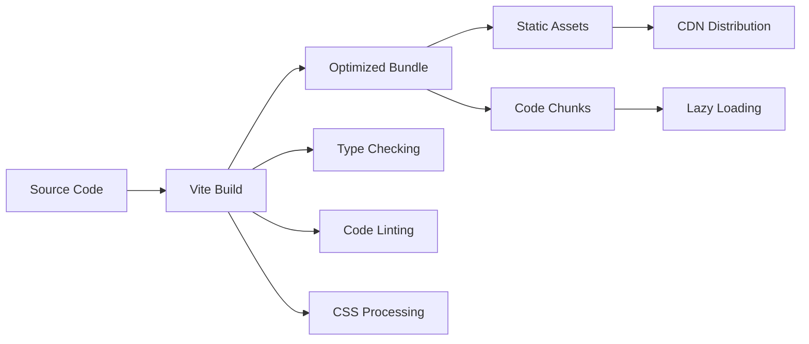
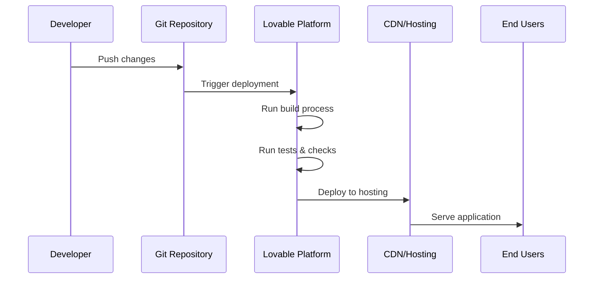
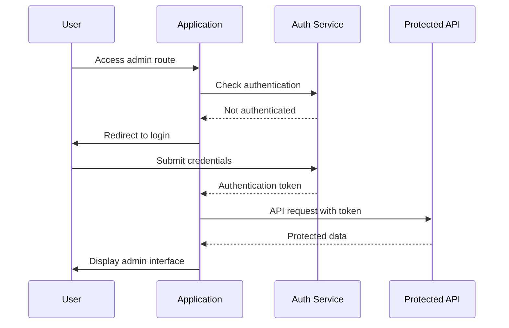
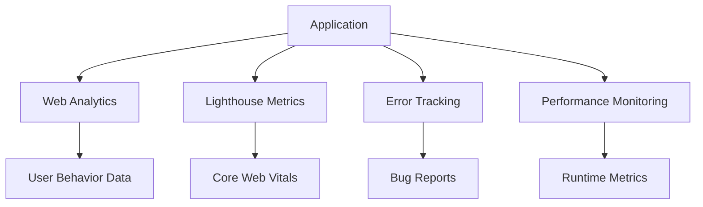
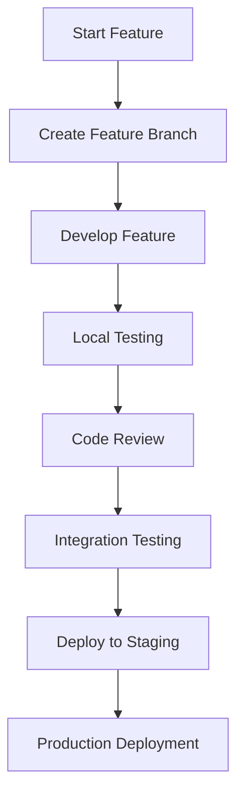

# Architecture Guide

This document provides a comprehensive overview of the Limitless Digital Agency Platform architecture, design decisions, and implementation patterns.

## 📊 System Overview



## 🏗 Application Architecture

### Core Principles

1. **Feature-Based Organization**: Code is organized by business features rather than technical layers
2. **Separation of Concerns**: Clear boundaries between public website and admin functionality
3. **Component Composition**: Reusable components built using composition patterns
4. **Type Safety**: Comprehensive TypeScript coverage for better developer experience
5. **Performance First**: Code splitting, lazy loading, and optimized bundle sizes

### Directory Structure

```
src/
├── app/                    # Application bootstrapping and providers
│   ├── App.tsx            # Main application component
│   ├── main.tsx           # Application entry point
│   └── providers/         # Global context providers
│
├── features/              # Feature-based code organization
│   ├── public-website/   # Public-facing website features
│   │   ├── components/   # Public website components
│   │   ├── pages/       # Public pages (Home, About, etc.)
│   │   ├── hooks/       # Public website hooks
│   │   └── types.ts     # Public website types
│   │
│   ├── admin-panel/     # Admin management system
│   │   ├── components/  # Admin-specific components
│   │   ├── pages/      # Admin pages (Dashboard, etc.)
│   │   ├── hooks/      # Admin hooks
│   │   └── types.ts    # Admin types
│   │
│   ├── navigation/      # Global navigation system
│   ├── contact/        # Contact forms and management
│   ├── portfolio/      # Portfolio showcase
│   └── shared/         # Cross-feature shared code
│
├── shared/             # Application-wide shared resources
│   ├── components/    # Reusable UI components
│   │   ├── ui/       # shadcn/ui base components
│   │   ├── layout/   # Layout components
│   │   ├── forms/    # Form components
│   │   └── feedback/ # Toasts, alerts, loading states
│   │
│   ├── hooks/        # Shared custom hooks
│   ├── lib/          # Utility functions
│   ├── types/        # Shared TypeScript types
│   ├── constants/    # Application constants
│   └── config/       # Configuration files
│
├── assets/           # Static assets
└── styles/          # Global styles and themes
```

## 🔄 Data Flow Architecture

### State Management Strategy

The application uses a multi-layered state management approach:

1. **Server State** - TanStack Query for API data caching and synchronization
2. **Form State** - React Hook Form for form management and validation
3. **Component State** - React useState/useReducer for local component state
4. **Global State** - React Context for truly global application state



### Component Communication



## 🎨 UI Architecture

### Design System Structure

```
Design System
├── Tokens                 # CSS custom properties
│   ├── Colors            # Semantic color palette
│   ├── Typography        # Font scales and weights
│   ├── Spacing           # Margin/padding scales
│   └── Animations        # Transition and animation values
│
├── Base Components       # shadcn/ui components
│   ├── Primitives       # Button, Input, Select, etc.
│   ├── Compositions     # Dialog, Popover, Dropdown
│   └── Feedback         # Toast, Alert, Loading
│
├── Feature Components   # Business-specific components
│   ├── Navigation      # Header, Sidebar, Breadcrumb
│   ├── Content        # Hero, Card, Gallery
│   └── Forms          # ContactForm, LoginForm
│
└── Layout System       # Page and section layouts
    ├── Grid           # CSS Grid utilities
    ├── Flexbox        # Flexbox utilities
    └── Containers     # Max-width containers
```

### Component Hierarchy



## 🚦 Routing Architecture

### Route Organization

```typescript
// Public Routes
const publicRoutes = [
  { path: '/', element: <Home /> },
  { path: '/about', element: <About /> },
  { path: '/services', element: <Services /> },
  { path: '/work', element: <Work /> },
  { path: '/insights', element: <Insights /> },
  { path: '/contact', element: <Contact /> },
];

// Admin Routes (nested under /admin)
const adminRoutes = [
  { path: '', element: <Dashboard /> },
  { path: 'contacts', element: <ContactManagement /> },
  { path: 'content', element: <ContentManagement /> },
  { path: 'portfolio', element: <PortfolioManagement /> },
  { path: 'community', element: <CommunityManagement /> },
  { path: 'hiring', element: <HiringManagement /> },
  { path: 'analytics', element: <Analytics /> },
  { path: 'settings', element: <Settings /> },
];
```

### Navigation Flow



## 🔧 Build & Deployment Architecture

### Build Process



### Performance Optimizations

1. **Code Splitting**: Routes and heavy components are lazy-loaded
2. **Bundle Analysis**: Webpack bundle analyzer for size optimization
3. **Asset Optimization**: Image compression and format optimization
4. **Caching Strategy**: Browser and CDN caching for static assets
5. **Tree Shaking**: Unused code elimination

### Deployment Pipeline



## 🔐 Security Architecture

### Authentication Flow



### Security Measures

1. **Input Validation**: Zod schemas for all form inputs
2. **XSS Prevention**: React's built-in XSS protection
3. **CSRF Protection**: Token-based request validation
4. **Secure Headers**: Content Security Policy and security headers
5. **Environment Variables**: Secure secret management

## 📊 Performance Monitoring

### Key Metrics

1. **Core Web Vitals**
   - Largest Contentful Paint (LCP) < 2.5s
   - First Input Delay (FID) < 100ms
   - Cumulative Layout Shift (CLS) < 0.1

2. **Bundle Size Metrics**
   - Initial bundle < 200KB gzipped
   - Route chunks < 100KB gzipped
   - Asset optimization > 90%

3. **Runtime Performance**
   - Component render time
   - Memory usage tracking
   - JavaScript execution time

### Monitoring Tools



## 🔄 Development Workflow

### Feature Development Process



### Code Quality Pipeline

1. **Pre-commit**: ESLint and Prettier checks
2. **CI/CD**: Automated testing and building
3. **Code Review**: Peer review requirements
4. **Integration Tests**: Automated testing suite
5. **Performance Tests**: Bundle size and runtime checks

## 🎯 Future Architecture Considerations

### Scalability Planning

1. **Micro-frontend Architecture**: Potential split into smaller applications
2. **API Integration**: GraphQL or REST API integration
3. **Real-time Features**: WebSocket integration for live updates
4. **Internationalization**: Multi-language support architecture
5. **Progressive Web App**: Offline capability and app-like experience

### Technology Evolution

1. **React Server Components**: Server-side rendering improvements
2. **Build Tool Migration**: Potential migration to newer build tools
3. **State Management**: Potential migration to Zustand or Redux Toolkit
4. **Testing Strategy**: Enhanced testing with Playwright/Cypress
5. **Monitoring**: Advanced application performance monitoring

---

This architecture is designed to be maintainable, scalable, and developer-friendly while providing excellent user experience and performance.