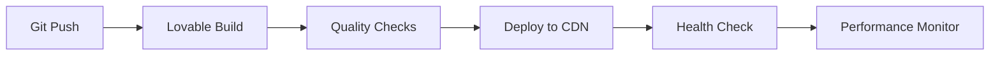

# Deployment Guide

This guide covers the deployment process, hosting setup, and production environment configuration for the Limitless Digital Agency Platform.

## 🚀 Overview

The application is deployed on the **Lovable Platform**, which provides:
- Automatic deployments from Git repository
- Built-in CDN and hosting infrastructure
- SSL certificates and custom domain support
- Environment variable management
- Build optimization and caching

## 🏗 Build Process

### Local Production Build

```bash
# Create optimized production build
npm run build

# Preview production build locally
npm run preview

# Check build size and performance
npm run build && ls -la dist/
```

### Build Configuration

The build process uses Vite with the following optimizations:

**vite.config.ts**
```typescript
export default defineConfig({
  build: {
    // Output directory
    outDir: 'dist',
    
    // Generate source maps for debugging
    sourcemap: true,
    
    // Chunk size warnings
    chunkSizeWarningLimit: 1000,
    
    // Rollup options
    rollupOptions: {
      output: {
        // Manual chunk splitting for better caching
        manualChunks: {
          'react-vendor': ['react', 'react-dom'],
          'router-vendor': ['react-router-dom'],
          'ui-vendor': ['@radix-ui/react-dialog', '@radix-ui/react-dropdown-menu']
        }
      }
    }
  }
});
```

### Build Optimization Checklist

- [ ] Bundle size under 200KB gzipped for initial load
- [ ] Code splitting implemented for routes
- [ ] Images optimized and properly sized
- [ ] CSS purged of unused styles
- [ ] JavaScript minified and tree-shaken
- [ ] Source maps generated for debugging

## 🌐 Lovable Platform Deployment

### Automatic Deployment

1. **Push to Main Branch**
   ```bash
   git add .
   git commit -m "feat: add new feature"
   git push origin main
   ```

2. **Automatic Build Trigger**
   - Lovable detects the push
   - Initiates build process
   - Runs quality checks
   - Deploys to staging/production

3. **Deployment Verification**
   - Check deployment logs in Lovable dashboard
   - Verify application loads correctly
   - Test critical user flows
   - Monitor performance metrics

### Manual Deployment

If needed, you can trigger manual deployments:

1. Open Lovable project dashboard
2. Navigate to "Deployments" section
3. Click "Deploy Now" button
4. Monitor build and deployment progress

### Environment Configuration

#### Production Environment Variables

```bash
# Application Configuration
NODE_ENV=production
VITE_APP_TITLE="Limitless Digital Agency"
VITE_APP_DESCRIPTION="Professional digital agency services"

# Feature Flags
VITE_FEATURE_ADMIN_PANEL=true
VITE_FEATURE_ANALYTICS=true
VITE_FEATURE_CHATBOT=true

# External Services (managed via Lovable Secrets)
# STRIPE_PUBLIC_KEY - Managed via secrets
# ANALYTICS_ID - Managed via secrets
# EMAIL_SERVICE_KEY - Managed via secrets
```

#### Secrets Management

Sensitive configuration is managed through Lovable Cloud:

1. **Access Secrets Panel**
   - Project Settings → Secrets
   - Add environment-specific secrets
   - Reference in application code

2. **Example Secret Usage**
   ```typescript
   // Access secrets in application
   const stripeKey = process.env.STRIPE_PUBLIC_KEY;
   const analyticsId = process.env.ANALYTICS_ID;
   ```

## 🔧 Custom Domain Setup

### Domain Configuration

1. **Purchase Domain**
   - Register domain with your preferred provider
   - Configure DNS settings

2. **Lovable Domain Setup**
   - Navigate to Project Settings → Domains
   - Add your custom domain
   - Follow DNS configuration instructions

3. **DNS Configuration**
   ```
   Type: CNAME
   Name: @ (or www)
   Value: [your-project].lovable.app
   TTL: 3600 (or default)
   ```

4. **SSL Certificate**
   - Lovable automatically provisions SSL certificates
   - HTTPS enforced for all traffic
   - Certificate auto-renewal

### Domain Verification

```bash
# Check DNS propagation
nslookup yourdomain.com

# Test HTTPS certificate
curl -I https://yourdomain.com

# Verify redirects
curl -I http://yourdomain.com
```

## 🔍 Monitoring & Analytics

### Performance Monitoring

**Core Web Vitals Targets:**
- Largest Contentful Paint (LCP): < 2.5s
- First Input Delay (FID): < 100ms  
- Cumulative Layout Shift (CLS): < 0.1

**Monitoring Tools:**
- Lovable built-in analytics
- Google PageSpeed Insights
- Web Vitals Chrome extension

### Application Monitoring

```typescript
// Performance monitoring setup
if (process.env.NODE_ENV === 'production') {
  // Initialize error tracking
  initErrorTracking();
  
  // Monitor Core Web Vitals
  getCLS(sendToAnalytics);
  getFID(sendToAnalytics);  
  getFCP(sendToAnalytics);
  getLCP(sendToAnalytics);
}
```

### Health Check Endpoints

```typescript
// Health check for uptime monitoring
export const healthCheck = {
  status: 'healthy',
  timestamp: new Date().toISOString(),
  version: process.env.VITE_APP_VERSION,
  environment: process.env.NODE_ENV
};
```

## 🚦 Deployment Pipeline

### CI/CD Workflow



### Quality Gates

1. **Pre-deployment Checks**
   - ESLint validation passes
   - TypeScript compilation succeeds
   - Build completes without errors
   - Bundle size within limits

2. **Post-deployment Verification**
   - Application loads successfully
   - Critical routes accessible
   - API endpoints responsive
   - Performance metrics acceptable

## 🔄 Rollback Strategy

### Automatic Rollback

Lovable provides automatic rollback capabilities:

1. **Failed Deployment Detection**
   - Build failures trigger automatic rollback
   - Health check failures initiate rollback
   - Performance degradation alerts

2. **Manual Rollback**
   - Access deployment history
   - Select previous stable version
   - One-click rollback to stable state

### Rollback Procedure

```bash
# Via Lovable Dashboard
1. Navigate to Deployments → History
2. Select stable deployment version
3. Click "Rollback to this version"
4. Confirm rollback action
5. Monitor rollback completion
```

## 📊 Performance Optimization

### Build Optimizations

1. **Code Splitting**
   ```typescript
   // Route-based code splitting
   const AdminPanel = React.lazy(() => import('./pages/admin/AdminLayout'));
   const PublicPages = React.lazy(() => import('./features/public-website'));
   ```

2. **Asset Optimization**
   ```typescript
   // Image optimization
   import heroImage from '@/assets/hero-image.jpg?webp';
   import logoSmall from '@/assets/logo.png?w=100&h=100';
   ```

3. **Bundle Analysis**
   ```bash
   # Analyze bundle composition
   npm run build
   npx vite-bundle-analyzer dist
   ```

### Runtime Optimizations

1. **Lazy Loading**
   ```typescript
   // Component lazy loading
   const HeavyComponent = React.lazy(() => import('./HeavyComponent'));
   
   // Image lazy loading
   
   ```

2. **Caching Strategy**
   ```typescript
   // Service worker for caching (if implemented)
   if ('serviceWorker' in navigator) {
     navigator.serviceWorker.register('/sw.js');
   }
   ```

## 🔐 Security Configuration

### Production Security Headers

```typescript
// Security headers (configured at hosting level)
const securityHeaders = {
  'Content-Security-Policy': "default-src 'self'; script-src 'self' 'unsafe-inline'",
  'X-Frame-Options': 'DENY',
  'X-Content-Type-Options': 'nosniff',
  'Referrer-Policy': 'strict-origin-when-cross-origin',
  'Permissions-Policy': 'camera=(), microphone=(), geolocation=()'
};
```

### Environment Security

1. **Secrets Management**
   - Never commit API keys to repository
   - Use Lovable Secrets for sensitive data
   - Rotate secrets regularly

2. **HTTPS Enforcement**
   - All traffic redirected to HTTPS
   - HSTS headers enabled
   - Secure cookie settings

## 📝 Deployment Checklist

### Pre-deployment

- [ ] Code reviewed and approved
- [ ] All tests passing locally
- [ ] Build completes without warnings
- [ ] Environment variables configured
- [ ] Secrets properly set up
- [ ] Performance benchmarks met

### Post-deployment

- [ ] Application loads successfully
- [ ] All routes accessible
- [ ] Forms submit correctly
- [ ] Admin panel functions properly
- [ ] Mobile responsiveness verified
- [ ] Performance metrics acceptable
- [ ] Error monitoring active

### Monitoring Setup

- [ ] Analytics tracking enabled
- [ ] Error reporting configured
- [ ] Performance monitoring active
- [ ] Uptime monitoring enabled
- [ ] Alert notifications configured

## 🆘 Troubleshooting

### Common Deployment Issues

1. **Build Failures**
   ```bash
   # Check build logs
   npm run build
   
   # Verify TypeScript compilation
   npx tsc --noEmit
   
   # Check for missing dependencies
   npm install
   ```

2. **Runtime Errors**
   ```typescript
   // Check browser console
   // Verify environment variables
   // Check network requests
   ```

3. **Performance Issues**
   ```bash
   # Analyze bundle size
   npm run build && ls -la dist/
   
   # Check for unused dependencies
   npx depcheck
   ```

### Support Resources

- Lovable Documentation: [https://docs.lovable.dev/](https://docs.lovable.dev/)
- Deployment Troubleshooting: [https://docs.lovable.dev/troubleshooting](https://docs.lovable.dev/troubleshooting)
- Community Support: [Lovable Discord](https://discord.lovable.dev/)

---

This deployment guide ensures reliable, performant, and secure production deployments of the Limitless Digital Agency Platform.